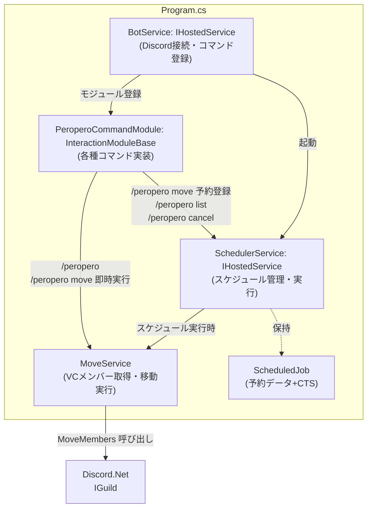

# Discord BOT 設計

## 1. アーキテクチャ概要

- 📜Program.cs - HostBuilder + DI設定
  - `BotService : IHostedService` - Discord接続・スラッシュコマンド登録
- 📂Commands/
  - `PeroperoCommandModule : InteractionModuleBase` - 各種コマンド実装（`/peropero`, `/peropero move`, `/peropero list`, `/peropero cancel`）
- 📂Services/
  - `MoveService` - VCメンバー取得・移動実行
  - `SchedulerService: IHostedService` - スケジュール管理・実行
- 📂Models/
  - `ScheduledJob` - 予約データ+ `CancellationTokenSource` -> class

### 依存関係



---

## 2. クラス設計

### 2.1 BotService

```csharp
public class BotService : IHostedService
```

**責務**
- DiscordSocketClient の初期化・ログイン
- InteractionService を使ってギルドコマンドを登録
- PeroperoCommandModule のモジュール登録

**主要メンバー**

| メンバー | 種別 | 説明 |
|----------|------|------|
| `StartAsync(CancellationToken)` | method | Discord接続・コマンド登録 |
| `StopAsync(CancellationToken)` | method | Discord切断 |

**設定値**
- `DISCORD_TOKEN`（環境変数）: ログイントークン
- `Discord:GuildId`（appsettings.json）: ギルドコマンド登録先

---

### 2.2 PeroperoCommandModule

```csharp
public class PeroperoCommandModule : InteractionModuleBase<SocketInteractionContext>
```

**責務**
- スラッシュコマンド `/peropero` とそのサブコマンド定義
- コマンド実行者のロール権限チェック（`Discord:AllowedRoleIds` と照合）
- コマンドを実行したチャンネルがVCに帰属しているかの確認（移動元VCの確定）
- 移動元VCをコマンド実行時点で確定・記録

**コマンドメソッド**

| メソッド | シグネチャ | 説明 |
|----------|-----------|------|
| `MoveAsync` | `(IVoiceChannel to, string? at = null)` | 即時または予約移動 |
| `ListAsync` | `()` | スケジュール一覧表示 |
| `CancelAsync` | `(string id)` | スケジュールキャンセル |

**権限チェックロジック**
```
実行者のロールID一覧 ∩ AllowedRoleIds ≠ 空 → 実行許可
空 → "このコマンドを実行する権限がありません" を Ephemeral で返す
```

**エラーケース**

| 条件 | レスポンス |
|------|-----------|
| コマンド実行チャンネルがVCに帰属していない | エラーメッセージをテキストチャンネルに返す |
| 移動元VCにメンバーが誰もいない（即時実行・予約コマンド実行時） | エラーメッセージをテキストチャンネルに返す |
| `at` が過去日時 | エラーメッセージを返す |
| `at` のフォーマット不正 | エラーメッセージを返す（期待フォーマット: `yyyy-MM-dd HH:mm` または `HH:mm`） |

---

### 2.3 MoveService

```csharp
public class MoveService
```

**責務**
- 指定VCの全メンバーを取得
- 各メンバーを移動先VCへ移動（`MoveMembers` 権限が必要）
- 実行結果（成功/失敗）を返す

**メソッド**

```csharp
public async Task<MoveResult> ExecuteAsync(
    IVoiceChannel fromVc,
    IVoiceChannel toVc)
```

**MoveResult**

```csharp
public record MoveResult(
    bool IsSuccess,
    int MovedCount,
    string? ErrorMessage
);
```

**動作**
1. `fromVc.GetUsersAsync()` で接続中の全メンバーを取得
2. メンバーが0人の場合は `IsSuccess = false`、`MovedCount = 0`、`ErrorMessage` に該当メッセージをセットして返す
3. 各メンバーに対して `user.ModifyAsync(x => x.Channel = toVc)` を呼び出す
4. 全員移動後に `MoveResult` を返す
5. 例外発生時は `IsSuccess = false` で `ErrorMessage` にメッセージをセットして返す

---

### 2.4 SchedulerService

```csharp
public class SchedulerService : IHostedService
```

**責務**
- `ScheduledJob` のCRUD管理
- 各ジョブを指定日時に `MoveService.ExecuteAsync` で実行
- 実行成功時に `ToVc` のテキストチャンネルへ成功メッセージを投稿
- 実行失敗時に `NotifyChannelId` のチャンネルへエラーを投稿
- 実行済みジョブのリストからの削除

**フィールド**

```csharp
private readonly List<ScheduledJob> _jobs = new();
private readonly SemaphoreSlim _lock = new(1, 1); // スレッドセーフなCRUD用
```

**メソッド**

| メソッド | シグネチャ | 説明 |
|----------|-----------|------|
| `AddJobAsync` | `(ScheduledJob job) → Task` | ジョブ登録・タスク起動 |
| `GetAllJobs` | `() → IReadOnlyList<ScheduledJob>` | 一覧取得 |
| `CancelJobAsync` | `(Guid id) → Task<bool>` | CTSキャンセル・リストから削除。該当なしは `false` |
| `StartAsync` | `(CancellationToken)` | IHostedService実装（初期化のみ） |
| `StopAsync` | `(CancellationToken)` | 全ジョブをキャンセルしてシャットダウン |

**ジョブ実行ロジック（AddJobAsync 内部）**

```
1. job をリストに追加
2. Task.Run で以下を非同期実行:
   a. 現在時刻 → ExecuteAt までの差分を計算
   b. Task.Delay(差分, job.Cts.Token) で待機
   c. キャンセルされた場合 → OperationCanceledException をキャッチして終了
   d. 時刻到達 → MoveService.ExecuteAsync を呼び出す
   e. 成功時 → job.ToVc のテキストチャンネルに成功メッセージを投稿
   f. 失敗時（メンバー0人・権限エラー等） → job.NotifyChannelId のチャンネルにエラーメッセージを投稿
   g. 完了後 → リストからジョブを削除
```

---

### 2.5 ScheduledJob

```csharp
public class ScheduledJob
```

**責務**
- 予約データの保持
- 自身の実行タスクをキャンセルするCTSの保持

**プロパティ**

| プロパティ | 型 | 説明 |
|-----------|-----|------|
| `Id` | `Guid` | 予約ID（表示時は先頭8文字で短縮） |
| `FromVc` | `IVoiceChannel` | 移動元VC（コマンド実行時に確定） |
| `ToVc` | `IVoiceChannel` | 移動先VC |
| `ExecuteAt` | `DateTimeOffset` | 実行日時（JST、UTC+9で保持） |
| `RequestedBy` | `ulong` | 予約したユーザーのID |
| `NotifyChannelId` | `ulong` | エラー通知先テキストチャンネルのID（コマンドを実行したテキストチャンネル） |
| `Cts` | `CancellationTokenSource` | キャンセル制御用（`new()` で初期化） |

---

## 3. シーケンス図

### 3.1 `/peropero move <to>` — 即時実行

```
User → Discord: /peropero move to:#vc-b
Discord → CommandModule: InteractionCreated
CommandModule → CommandModule: 権限チェック
CommandModule → CommandModule: コマンド実行チャンネルのVC確認（fromVc 確定）
CommandModule → MoveService: ExecuteAsync(fromVc, toVc)
MoveService → Discord API: GetUsersAsync()
MoveService → MoveService: メンバー数確認（0人ならエラーを返す）
MoveService → Discord API: ModifyAsync(channel=toVc) × メンバー数
MoveService → CommandModule: MoveResult
alt 成功時
  CommandModule → Discord API: toVc のテキストチャンネルに "〇人を #vc-b に移動したよ！"
else 失敗時
  CommandModule → User: エラーメッセージ
end
```

### 3.2 `/peropero move <to> at:<datetime>` — 予約実行

```
User → Discord: /peropero move to:#vc-b at:2024-01-15 20:00
Discord → CommandModule: InteractionCreated
CommandModule → CommandModule: 権限チェック
CommandModule → CommandModule: コマンド実行チャンネルのVC確認（fromVc 確定）
CommandModule → CommandModule: at パース・過去日時チェック
CommandModule → CommandModule: 移動元VCのメンバー数確認（0人ならエラー）
CommandModule → SchedulerService: AddJobAsync(job)
SchedulerService → SchedulerService: Task.Delay(ExecuteAt - Now)
CommandModule → User: "2024-01-15 20:00 JST に予約しました（ID: xxxxxxxx）"

--- 指定時刻到達 ---

SchedulerService → MoveService: ExecuteAsync(fromVc, toVc)
MoveService → Discord API: GetUsersAsync()
MoveService → MoveService: メンバー数確認（0人ならエラーを返す）
MoveService → Discord API: ModifyAsync(channel=toVc) × メンバー数
MoveService → SchedulerService: MoveResult
alt 成功時
  SchedulerService → Discord API: toVc のテキストチャンネルに成功メッセージを投稿
else 失敗時
  SchedulerService → Discord API: チャンネル(NotifyChannelId)にエラー投稿
end
SchedulerService → SchedulerService: リストからジョブ削除
```

### 3.3 `/peropero cancel <id>`

```
User → Discord: /peropero cancel xxxxxxxx
Discord → CommandModule: InteractionCreated
CommandModule → CommandModule: 権限チェック
CommandModule → SchedulerService: CancelJobAsync(id)
alt 該当ジョブあり
  SchedulerService → SchedulerService: job.Cts.Cancel()
  SchedulerService → SchedulerService: リストから削除
  SchedulerService → CommandModule: true
  CommandModule → User: "予約 xxxxxxxx をキャンセルしました"
else 該当なし
  SchedulerService → CommandModule: false
  CommandModule → User: "指定された予約が見つかりません"
end
```

---

## 4. 設定値管理

### 4.1 appsettings.json スキーマ

```json
{
  "Discord": {
    "GuildId": 123456789012345678,
    "AllowedRoleIds": [
      111111111111111111,
      222222222222222222
    ]
  }
}
```

### 4.2 環境変数

| 変数名 | 説明 |
|--------|------|
| `DISCORD_TOKEN` | BOTのトークン |

ローカル開発時は `.env` で管理し `.gitignore` に追加する。
本番環境は `docker-compose.yml` の `environment:` で注入する。

### 4.3 docker-compose.yml（本番）

```yaml
services:
  bot:
    build: .
    environment:
      - DISCORD_TOKEN=${DISCORD_TOKEN}
    restart: unless-stopped
```

---

## 5. エラーハンドリング仕様

| 発生箇所 | 条件 | 対処 |
|----------|------|------|
| CommandModule | 権限なし | Ephemeral でエラーメッセージを返す |
| CommandModule | コマンド実行チャンネルがVCに帰属していない | テキストチャンネルにエラーメッセージを返す |
| CommandModule | 移動元VCにメンバーが誰もいない（即時・予約コマンド実行時） | テキストチャンネルにエラーメッセージを返す |
| CommandModule | `at` フォーマット不正 | Ephemeral でエラーメッセージを返す |
| CommandModule | `at` が過去日時 | Ephemeral でエラーメッセージを返す |
| MoveService | 移動元VCにメンバーが誰もいない | `MoveResult.IsSuccess = false` で返す |
| MoveService | 移動失敗（権限不足など） | `MoveResult.IsSuccess = false` で返す |
| SchedulerService | 実行時エラー（メンバー0人・権限不足等） | `NotifyChannelId` のチャンネルにエラーを投稿 |
| SchedulerService | BOT再起動 | スケジュールは揮発。再予約はユーザー責任 |

---

## 6. Discordの必要権限

| 権限 | 用途 |
|------|------|
| `MoveMembers` | VCメンバーの移動 |
| `SendMessages` | テキストチャンネルへのエラー通知 |
| `UseApplicationCommands` | スラッシュコマンドの受信 |
